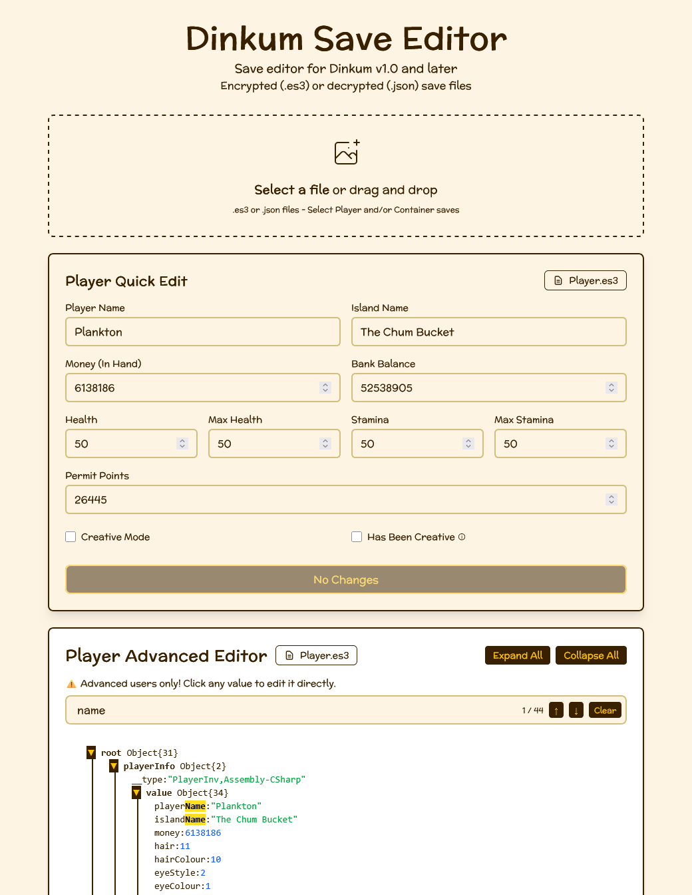

# Dinkum Save Editor

A web-based save file editor for the game
[Dinkum](https://store.steampowered.com/app/1062520/Dinkum/). Edit your player
data, inventory, and more - all in your browser with no server uploads required.

Try it out here: https://dinkum-save-editor.acidworks.deno.net/

## Features

- 🌐 **Browser-Based**: All processing happens in your browser — your save files
  never leave your device
- 🪙 **Edit Currency**: Set your wallet and bank balance
- ❤️ **Health & Stamina**: Set current and maximum health and stamina values
- 👤 **Player & World Names**: Change player name and world name
- 🎮 **Re-enable Steam Achievements**: Remove the creative mode flag that blocks
  Steam achievements on your save
- 📦 **Quick Edit**: Fast access to common changes
- 🔧 **Advanced Editor**: Full JSON editing for power users

## Preview

[](./assets/editor-preview.png)

## How It Works

Dinkum save files (`.es3` extension) are encrypted using the
[EasySave3](https://docs.moodkie.com/easy-save-3/) library.

This save editor:

1. Decrypts your save file(s)
2. Parses the JSON data structure
3. Allows editing through a user-friendly interface
4. Re-encrypts the data with the same encryption method
5. Downloads the modified save file

## Save File Locations

Dinkum save files are typically located at:

- **Windows**: `%USERPROFILE%\AppData\LocalLow\James Bendon\Dinkum\`
- **Linux / Steam Deck**:
  `~/.local/share/Steam/steamapps/compatdata/1062520/pfx/drive_c/users/steamuser/AppData/LocalLow/James Bendon/Dinkum`

Common save files:

- `Player.es3` - Player data (health, stats, inventory)
- `Container.es3` - Chest and container data
- `MapSave.dat` - World map data (different format, not supported)

## Disclaimer

⚠️ **Important**: Always backup your original save files before editing!

This is an unofficial fan-made tool. Dinkum is a trademark of James Bendon. This
tool is provided "as is" without warranty. Use at your own risk. The developers
are not responsible for any data loss or game issues.

### Encryption Details

- **Algorithm**: AES-128-CBC
- **Key Derivation**: PBKDF2 with SHA-1
- **Password**: `jamesbendon` (named after James Bendon, the creator of Dinkum)
- **Iterations**: 100
- **Key Length**: 16 bytes (128 bits)

### Finding the Password

The encryption password is hardcoded in the game's files. We've included a
Python script in the `finding-the-password/` directory that can automatically
extract this password from your Dinkum installation. See the
[finding-the-password/README.md](finding-the-password/README.md) for detailed
instructions on how to use it.

## Credits & Attributions

This project builds upon the work of others in the Dinkum modding community:

- **Design inspiration**:
  [kieransouth/dinkum-save-editor](https://github.com/kieransouth/dinkum-save-editor)
  (MIT License)
- **Encryption/decryption code**:
  [alextusinean/es3-editor](https://github.com/alextusinean/es3-editor) (GPL-3.0
  License)
- **McLaren font**: [Google Fonts](https://fonts.google.com/specimen/McLaren)
  (OFL License)

## License

This project is open source. See individual component licenses in the credits
section above.

## Contributing

Contributions are welcome! Please feel free to submit a Pull Request.

---

Made with 💛 for the Dinkum community

## Development

This project is built with:

- **[Deno](https://deno.com/)** - Modern JavaScript/TypeScript runtime
- **[Fresh](https://fresh.deno.dev/)** - Next-gen web framework for Deno
- **[Preact](https://preactjs.com/)** - Fast 3kB alternative to React
- **[Tailwind CSS](https://tailwindcss.com/)** - Utility-first CSS framework
- **[Vite](https://vitejs.dev/)** - Fast build tool and dev server

### Prerequisites

- [Deno](https://deno.com/) 2.0 or higher

### Getting Started

1. **Clone the repository**
   ```bash
   git clone https://github.com/ErikMartensson/dinkum-save-editor.git
   cd dinkum-save-editor
   ```

2. **Install dependencies** (Deno handles this automatically)
   ```bash
   deno install
   ```

3. **Start the development server**
   ```bash
   deno task dev
   ```

4. **Open your browser**

   Navigate to `http://localhost:5173` (or the port shown in your terminal)

### Available Commands

- `deno task dev` - Start development server with hot reload
- `deno task build` - Build for production
- `deno task start` - Start production server
- `deno task check` - Run formatting, linting, and type checking
- `deno task update` - Update Fresh framework

### Development Auto-Load Feature

For faster development, the app can automatically load save files on startup:

1. Create a `selected-saves/` directory in the project root
2. Place your test `.es3` or `.json` files in this directory
3. Start the dev server - files will auto-load after each hot-reload

This feature is **development-only** and disabled in production.

### Project Structure

```
dinkum-save-editor/
├── routes/              # Fresh routes (pages)
├── islands/             # Interactive Preact components
├── components/          # Static Preact components
├── utils/               # Utility functions (crypto, types)
├── static/              # Static assets (fonts, icons)
├── finding-the-password/ # Python script to find encryption password
└── assets/              # CSS and other assets
```
